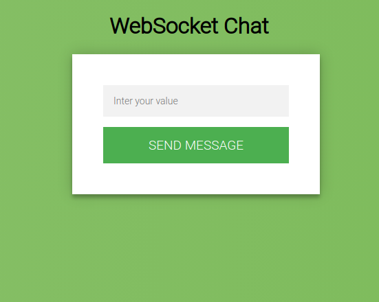

##Websocket
Task:
 С использованием fastapi необходимо сделать веб-страницу сочетающую из:
1. Формы с текстовым полем
2. Списком сообщений пронумерованных с 1

Страница подключается к серверу по WebSocket.
С помощью формы вы можете отправить сообщение на сервер, где оно будет принято и добавлен порядковый номер этого
сообщения.
Далее сообщение с порядковым номером отправляется на страницу и отображается в списке.

При перезагрузке страницы данные о номерации теряются и начинается с 1.

Страница должна быть динамической, обрабатывать все действия без перезагрузки. Имеется ввиду что при отправке сообщения
на сервер через вебсокет страница не должна перезагружаться.  
Взаимодействие с сервером по вебсокет нужно реализовать с использованием JSON. Формат и именование полей не важно.
можно использовать любые.

##Приложение:
Необходимо склонировать  проект в своей репозиторий через:
git clone
Развернуть виртуальное окружение и установить зависимости из файла requirements.txt  через команду:
pip install -r requirements.txt
переходим в директорию app/ и стартуем приложение командой:
uvicorn websocket:router --reload
По адресу: http://127.0.0.1:8000/ будет доступна главная страница приложения

если отправить пустое сообщение будет выдано предупреждение

Если сообщение не пустое, то оно добавляется в список под формой

